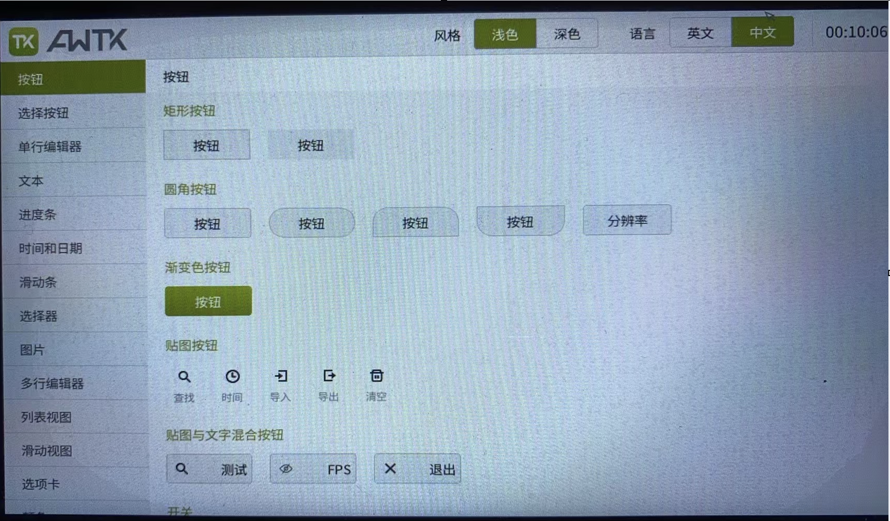

# 在全智 T113-S3 开发板上运行 AWTK

## 1. 准备工作 

> 如果某些步骤已经完成，请跳过。

## 1.1 安装 Ubuntu 22 虚拟机

## 1.2 安装 sshd 服务并启动

```bash
sudo apt-get install openssh-server
sudo systemctl start sshd
```

## 1.3 安装 awtk 需要的编译环境

```bash
sudo apt-get install gcc g++ scons libsndio-dev libgtk-3-dev libglu1-mesa libglu1-mesa-dev libgl1-mesa-glx libgl1-mesa-dev libasound2-dev libibus-1.0-dev fcitx-libs-dev git vim clang-format libharfbuzz-dev nodejs libreadline-dev
```

## 1.4 安装交叉编译工具链

```bash
sudo apt-get install g++-arm-linux-gnueabi
```

## 1.5 下载 awtk/awtk-linux-fb 源码

* 创建工作目录
  
```bash
mkdir -p ~/work/awtk-root
cd ~/work/awtk-root
```

* 下载 awtk 源码
  
```bash
git clone https://github.com/zlgopen/awtk
```

* 下载 awtk-linux-fb 源码
  
```bash
git clone https://github.com/zlgopen/awtk-linux-fb
``` 

## 2. 构建 rootfs

> 因为笔者用的 MacPro M2，上面安装的是 Ubuntu 22 虚拟机，由于是 arm64 的 CPU，官方的工具链运行不了，而 Ubuntu 上工具链编译的程序，在板子自带的系统上运行不了，所以只能自己编译 rootfs。
> 其它系统，如果不需要请跳过。

### 2.1 下载 busybox 源码

```bash
mkdir -p ~/work/awtk-root/rootfs
cd ~/work/awtk-root/rootfs
wget https://busybox.net/downloads/busybox-1.36.1.tar.bz2
tar -xvf busybox-1.36.1.tar.bz2
```

### 2.2 编译 busybox

```bash
cd busybox-1.36.1
make defconfig
make CROSS_COMPILE=arm-linux-gnueabi- ARCH=arm
make CROSS_COMPILE=arm-linux-gnueabi- ARCH=arm install CONFIG_PREFIX=~/work/awtk-root/rootfs/rootfs
```

* 拷贝库文件
  
```bash
cd ~/work/awtk-root/rootfs/rootfs/
cp -arf /usr/arm-linux-gnueabi/lib .
rm -f lib/libasan.so.6* lib/*.a lib/*.o
```

* 创建必要的文件和目录

```bash
mkdir -p proc dev sys var tmp run etc
```

* 创建 etc/fstab 文件，其内容如下：

```bash
proc                 /proc                proc       defaults              0  0
sysfs                /sys                 sysfs       defaults             0   0
tmpfs                /run                 tmpfs      mode=0755,nodev,nosuid,strictatime 0  0
tmpfs                /tmp                 tmpfs      defaults              0  0
devtmpfs             /dev                 devtmpfs   defaults              0  0
```

* 创建 rootfs 压缩文件包

```
cd ..
tar czf rootfs.tar.gz rootfs
```

* 启动 http 服务

> 打开一个新的终端

```bash
~/work/awtk-root
python3 -m http.server 8080 --directory .
```


## 3. 编译 awtk-linux-fb

### 3.1 编译
  
```bash
cd ~/work/awtk-root/awtk-linux-fb
scons TOOLS_PREFIX=arm-linux-gnueabi-
```

### 3.2 生成压缩包
  
```bash
./release.sh
```

* 创建设备配置文件：release/config/devices.json 其内容如下：
  
```json
{
    "/dev/fb0" : { 
        "type" : "fb"
    },  
    "/dev/input/event2" : { 
        "type" : "input"
    }   
}
```

* 重新生成压缩包

```
tar czf release.tar.gz release
```

## 4. 下载 rootfs.tar.gz 和 release.tar.gz 到开发板

### 4.1 启动网络

> 下列参数据实际情况修改

```bash
ifconfig eth0 192.168.8.139 netmask 255.255.255.0 up
route add default gw 192.168.8.1 eth0

ifconfig
route -n
```

### 4.2 下载 rootfs.tar.gz

> flash 比较小，这里下载到内存

* 下载 rootfs.tar.gz
  
```bash
cd /tmp
wget http://192.168.8.242:8080/rootfs/rootfs.tar.gz
```

* 解压 rootfs.tar.gz
  
```bash
tar xf rootfs.tar.gz
```

* 挂载 rootfs
  
```bash
chroot rootfs
mount -a
```

### 4.3 下载 release.tar.gz

* 下载 release.tar.gz
  
```bash
wget http://192.168.8.242:8080/awtk-linux-fb/release.tar.gz
```

* 解压 release.tar.gz
  
```bash
tar xf release.tar.gz
```

## 5. 运行 awtk-linux-fb

```bash
cd release/
./bin/demoui 
```

> 如果一切正常，可以用触摸屏操作，切换语言到中文，会看到如下界面：



