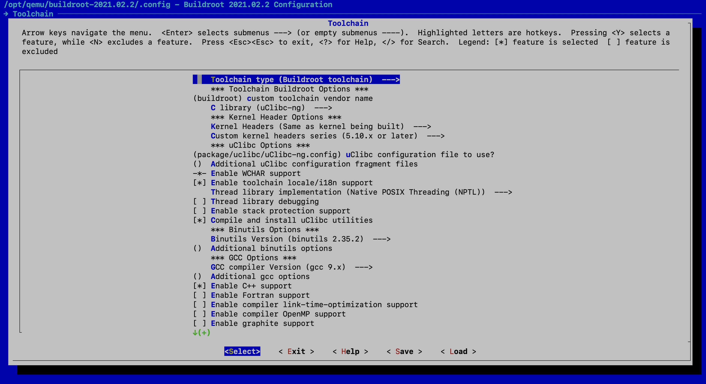
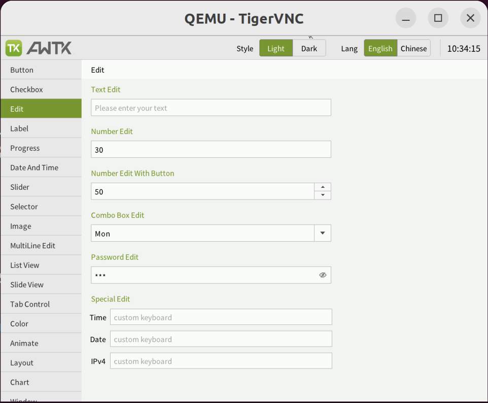

# 在 qemu 中运行 AWTK

虽然在 VMware 中也可以跑 awtk-linux-fb 版本，但是 [qemu](https://www.qemu.org) 能模拟一个更接近开发板的 arm-linux 环境。另外用来调试和学习一下 framebuffer 的驱动，也是很有意思的事。这里写个文档供大家参考。

> 在 Ubuntu 20 上测试运行。

## 构建 arm-linux 运行环境

手工从头构建 linux 系统还是挺麻烦的（以前干过这活）, 现在有 [buildroot](https://buildroot.org/) 这个神器，从头构建 linux 系统，实在太方便了。

* 确定工作目录

> 我们把工作目录固定到/opt/qemu 下，方便后面说明。

```
sudo mkdir /opt/qemu
sudo chown yourusername.yourgroup /opt/qemu
cd /opt/qemu
```

* 下载 buildroot

```
wget https://buildroot.org/downloads/buildroot-2021.02.2.tar.gz
tar xf buildroot-2021.02.2.tar.gz
cd buildroot-2021.02.2
```

* 配置

```
make qemu_arm_vexpress_defconfig
make menuconfig
```

在缺省配置下，修改 toolchain 的配置，增加 glibc/c++/gdb 三个配置项目。



保存退出。

* 编译

```
make -j4
```

> 时间比较久，请耐心等待。

## 构建 awtk-linux-fb

进入 awtk-linux-fb 目录：

* 配置

修改 awtk_config.py  中的 toolchain:

```
TOOLS_PREFIX='/opt/qemu/buildroot-2021.02.2/output/host/bin/arm-linux-'
TSLIB_LIB_DIR=''
```

* 编译

```
scons
```

* release

```
./release.sh
```

## 将 AWTK 加入 rootfs

* 回到 buildroot 的生成结果目录：

```
cd /opt/qemu/buildroot-2021.02.2/output/images
```

* 将 awtk 可执行文件拷贝到 rootfs

```
mkdir root
sudo mount -o loop rootfs.ext2 ./root
cd root/opt/
sudo cp -rf /opt/qemu/awtk-linux-fb/release .
cd -
```

## 运行

* 启动 qemu

```
./start-qemu.sh
```

* 进入 qemu 的中终端下启动 AWTK:

> 用户名 root 密码为空

```
cd /opt/release
./bin/demoui
```

* 在 Linux 主机的终端下启动 VNC Viewer

```
vncviewer localhost
```

可以看到并操作 AWTK 应用程序了：



## 附

### 修改分辨率

* 增加配置

vi /etc/fb.modes

```
mode "640x480-0"
	# D: 0.000 MHz, H: 0.000 kHz, V: 0.000 Hz
	geometry 640 480 640 480 16
	timings 0 48 16 33 10 96 2
	accel true
	rgba 5/11,6/5,5/0,0/0
endmode
```

* 使其生效

```
fbset 640x480-60
```

### debug kernel

画蛇添足一下，如果希望调试 linux 内核，比如 framebuffer，可以这样：

修改 start-qemu.sh，增加启动参数主机-s -S，让 qemu 启动 gdbserver，并等待 gdb 连接。然后启动 qemu。

```
#!/bin/sh
(
BINARIES_DIR="${0%/*}/"
cd ${BINARIES_DIR}

if [ "${1}" = "serial-only" ]; then
    EXTRA_ARGS='-nographic'
else
    EXTRA_ARGS='-serial stdio'
fi

export PATH="/opt/qemu/buildroot-2021.02.2/output/host/bin:${PATH}"
exec qemu-system-arm -M vexpress-a9 -smp 1 -m 256 -kernel zImage -dtb vexpress-v2p-ca9.dtb -drive file=rootfs.ext2,if=sd,format=raw -append "console=ttyAMA0,115200 rootwait root=/dev/mmcblk0"  -net nic,model=lan9118 -net user  ${EXTRA_ARGS} -s -S
)
```

* 使用 arm-linux-gdb 连接到 qemu。

```
export PATH=$PATH:/opt/qemu/buildroot-2021.02.2/output/host/bin

cd output/build/linux-5.10.7
arm-linux-gdb vmlinux
target remote :1234
```

设置断点并调试

```
b start_kernel
c
```
