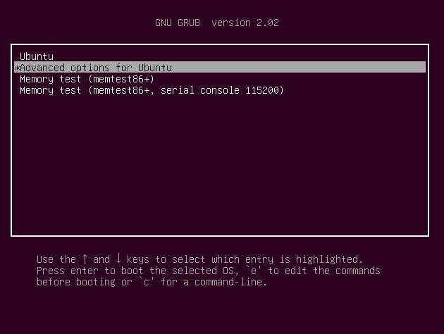
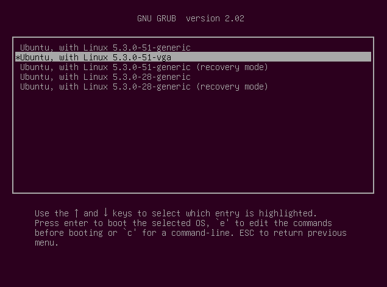

# 在虚拟机中使用 awtk-linux-fb

在 Linux 桌面模式下，不能直接运行 awtk-linux-fb。要运行 awtk-linux-fb 需要满足两个条件：

* 启动到 level 3，进入字符模式。

* 开启 vga 字符模式，同时指定 framebuffer 的分辨率。

为了做到以上两点，我们需要给 grub 增加一个菜单。用 vim 编辑 grub.cfg：

```
sudo vim /boot/grub/grub.cfg
```

把当前的缺省菜单拷贝一份，并作如下修改：

* 修改菜单标题。

* linux 在启动参数的最后添加下面的参数。

```
vga=788 3
```

> vga 用来设置 framebuffer 的分辨率。取值请参考：http://pierre.baudu.in/other/grub.vga.modes.html

> 3 表示不进入桌面模式。

示例：

```
  menuentry 'Ubuntu, with Linux 5.3.0-51-vga' --class ubuntu --class gnu-linux --class gnu --class os $menuentry_id_option 'gnulinux-5.3.0-51-generic-advanced-8e398504-f63e-4a7d-8d2e-8c839bc28666' {
    recordfail
    load_video
    gfxmode $linux_gfx_mode
    insmod gzio
    if [ x$grub_platform = xxen ]; then insmod xzio; insmod lzopio; fi
    insmod part_msdos
    insmod ext2
    set root='hd0,msdos1'
    if [ x$feature_platform_search_hint = xy ]; then
      search --no-floppy --fs-uuid --set=root --hint-bios=hd0,msdos1 --hint-efi=hd0,msdos1 --hint-baremetal=ahci0,msdos1  8e398504-f63e-4a7d-8d2e-8c839bc28666
    else
      search --no-floppy --fs-uuid --set=root 8e398504-f63e-4a7d-8d2e-8c839bc28666
    fi
    echo  'Loading Linux 5.3.0-51-generic ...'
          linux /boot/vmlinuz-5.3.0-51-generic root=UUID=8e398504-f63e-4a7d-8d2e-8c839bc28666 ro find_preseed=/preseed.cfg auto noprompt priority=critical locale=en_US quiet vga=788 3
    echo  'Loading initial ramdisk ...'
    initrd  /boot/initrd.img-5.3.0-51-generic
  }
```

把菜单等待时间修改为 10s :

```
if [ "${recordfail}" = 1 ] ; then
  set timeout=30
else
  if [ x$feature_timeout_style = xy ] ; then
    set timeout_style=hidden
    set timeout=10
  # Fallback hidden-timeout code in case the timeout_style feature is
  # unavailable.
  elif sleep --interruptible 0 ; then
    set timeout=10
  fi
fi
```

保存退出，重新启动系统。

在开机时，按下 Esc 键。选择上面所加的菜单项：





进入命令行模式后，由于分辨率不高，操作不方便。建议安装 sshd 服务，在 host 端，用 ssh 终端连接上来工作。

```
sudo apt-get install openssh-server
```

> 以上 Ubuntu 18 为例子，其它 linux 系统请自行调整。